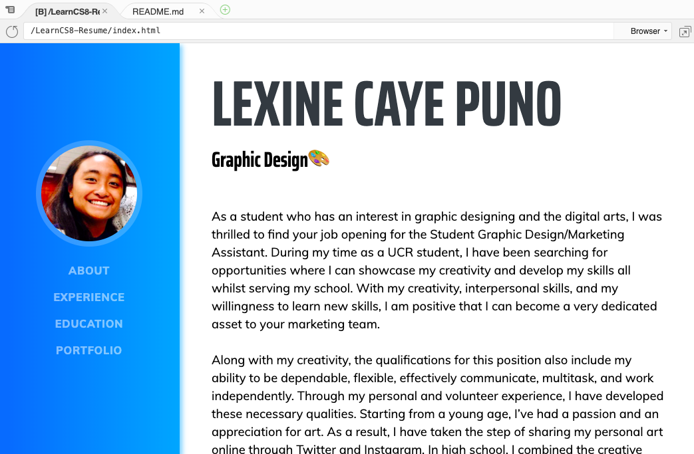

Lexine Caye Puno - Graphic Designer

[Lexine Caye Puno   ](https://5b6b1d2f805148318b4ed7f49d41544e.vfs.cloud9.us-east-2.amazonaws.com/_static/LearnCS8-Resume/index.html#page-top) 

-   [About](https://5b6b1d2f805148318b4ed7f49d41544e.vfs.cloud9.us-east-2.amazonaws.com/_static/LearnCS8-Resume/index.html#about)
-   [Experience](https://5b6b1d2f805148318b4ed7f49d41544e.vfs.cloud9.us-east-2.amazonaws.com/_static/LearnCS8-Resume/index.html#experience)
-   [Education](https://5b6b1d2f805148318b4ed7f49d41544e.vfs.cloud9.us-east-2.amazonaws.com/_static/LearnCS8-Resume/index.html#education)
-   [Portfolio](https://5b6b1d2f805148318b4ed7f49d41544e.vfs.cloud9.us-east-2.amazonaws.com/_static/LearnCS8-Resume/index.html#portfolio)

# Lexine Caye Puno

Graphic Design🎨

As a student who has an interest in graphic designing and the digital arts, I was thrilled to find your job opening for the Student Graphic Design/Marketing Assistant. During my time as a UCR student, I have been searching for opportunities where I can showcase my creativity and develop my skills all whilst serving my school. With my creativity, interpersonal skills, and my willingness to learn new skills, I am positive that I can become a very dedicated asset to your marketing team.  
  
Along with my creativity, the qualifications for this position also include my ability to be dependable, flexible, effectively communicate, multitask, and work independently. Through my personal and volunteer experience, I have developed these necessary qualities. Starting from a young age, I’ve had a passion and an appreciation for art. As a result, I have taken the step of sharing my personal art online through Twitter and Instagram. In high school, I combined the creative and time management skills I obtained through managing my art accounts with my schoolwork and extracurriculars. Serving as the Publicity and Design Head Committee Chair for my high school’s Air Force Junior Reserve Officer Training Corps’ annual JROTC ball, I was able to plan and organize meetings with my own team, while reaching out and communicating effectively with other Head committees. Here I also gained valuable skills and experience in budgeting while also researching and contacting the most-cost effective graphic design services. As a result, our team successfully promoted a large-scale event with videos and flyers and achieved an outstanding turnout rate that year. Upon entering college, I have transferred these skills to my current position through the UCR School of Medicine’s pipeline program, Mini Medical School, as an Assistant to the Media Coordinator. As a media assistant, I have taken the initiative to create and contribute to several new media projects including the creation of educational videos and digital content relevant to health issues in the Inland Empire community. I am also significantly involved in managing the organization’s Instagram account by creating fun promotional flyers for upcoming events and digital posts promoting health education. With my skills, experience, and passion, I believe I can help the UCR Campus Business Services in advertising and marketing.  
  
Overall, whether it is through social media or poster-making, I am willing to use my passion to create and help advertise for any of UCR’s departments. I may have limited experience in Photoshop or Illustrator, but I am always open to learn and develop the necessary skill for these programs. With my experience using similar resources such as the graphic design tools, IbisPaintX and Canva, I am confident in transferring these skills to Photoshop or Illustrator given the opportunity. I hope with the link to my portfolio, you can examine my ability to utilize various graphic design programs to their full potential and deliver out high-quality graphic designs and illustrations. Likewise, I am also willing to learn and collaborate effectively with my colleagues and professionals to provide services for various UCR departments with the goal of supporting crucial core campus operations. I look forward to your response and I thank you for your time. Thank You.

----------

## Experience

### Co-Media Director

[Mini Medical School](https://mms.ucr.edu/)

• Maintain social media accounts through advertising the organization’s events, deadlines, and service opportunities to MMS members and community members  
• Design and create digital content to educate community members on important health issues to bring awareness and promote healthy lifestyles  
• Capture members in action through photography  

January 2019 - Present

### Film Editor Volunteer

[Spotlight on Hope](https://highlanderlink.ucr.edu/organization/Spotlight_On_Hope_Film_Camp)

• Assist SOH film workshops through interacting and assisting cancer patients and their families  
• Create personal stop-motion films  

October 2018 - Present

### Publicity and Design Committee Head

[VMHS Air Force Junior Reserve Officer Training Corps](https://www.murrieta.k12.ca.us/Page/32397)

• Lead a group of about 5-10 people to help publicize the annual Military Ball  
• Designed/created promotional videos and flyers/table charts/certificates  

December 2016 - March 2017

### Freelance Artist

[QTLexstar](https://lpuno001.wixsite.com/portfolio)

• Designing, illustrating, and promoting my personal work on social media  
• Creating custom made graphics and illustrations for T-Shirt logos, art requests, and commissions  

January 2015 - Present

----------

## Education

### UC Riverside

Bachelor of Science, Neuroscience

Bachelors of Science

June 2021

----------

## Portfolio

   
   
   

----------

©Lexine Caye Puno

https://lpuno001.github.io/Lexinecayepuno-Resume/
